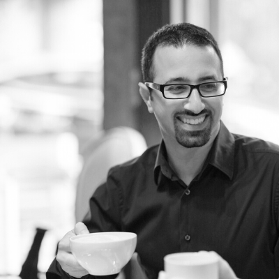

---
# Display name
title: Asaf Blubshtein

# Is this the primary user of the site?
superuser: true

# Role/position
role: Product Solutions Architect, VMware Cloud

# Status emoji
status:
  icon:

# Organizations/Affiliations
organizations:
- name: VMware
  url: ""

# Short bio (displayed in user profile at end of posts)
bio: My current role focuses on enabling VMware Cloud. I spend the rest of my time with my wife, our two cats, my home-lab, and our espresso machine.

#interests:
#- Artificial Intelligence
#- Computational Linguistics
#- Information Retrieval

#education:
#  courses:
#  - course: PhD in Artificial Intelligence
#    institution: Stanford University
#    year: 2012
#  - course: MEng in Artificial Intelligence
#    institution: Massachusetts Institute of Technology
#    year: 2009
#  - course: BSc in Artificial Intelligence
#    institution: Massachusetts Institute of Technology
#    year: 2008

# Social/Academic Networking
# For available icons, see: https://sourcethemes.com/academic/docs/page-builder/#icons
#   For an email link, use "fas" icon pack, "envelope" icon, and a link in the
#   form "mailto:your-email@example.com" or "#contact" for contact widget.
social:
- icon: envelope
  icon_pack: fas
  link: "mailto:sdcoffee.blog@gmail.com"  # For a direct email link, use "mailto:test@example.org".
- icon: linkedin
  icon_pack: fab
  link: https://www.linkedin.com/in/asaf-blubshtein
- icon: twitter
  icon_pack: fab
  link: https://twitter.com/AsafBlubshtein
- icon: github
  icon_pack: fab
  link: https://github.com/asafsb
- icon: rss
  icon_pack: fas
  link: index.xml

# Link to a PDF of your resume/CV from the About widget.
# To enable, copy your resume/CV to `static/files/cv.pdf` and uncomment the lines below.
# - icon: cv
#   icon_pack: ai
#   link: files/cv.pdf

# Enter email to display Gravatar (if Gravatar enabled in Config)
#email: ""
---

## About

Software-Defined Coffee is a personal blog started by me, Asaf Blubshtein. This blog will focus mainly on virtualization and VMware solutions, but also home-labs, certifications, and occasionally - coffee.

My current role is a Product Solutions Architect within the Cloud Infrastructure Business Group at VMware. In this role, I help the development of the VMware Cloud solutions by collaborating with different product teams and technology partners.

## [Certifications](https://www.credly.com/users/asaf-blubshtein/badges?sort=-state_updated_at)

  

    
  

  

    
  

  

    <!--  -->
    
  

  <!--  -->
  

  

    
  

  

    
  

  

    
  

  

    
  

  

    
  

  

  

  

  

## Disclaimer

The views and opinions expressed on this blog are my own and do not reflect the views and opinions of my employer.
