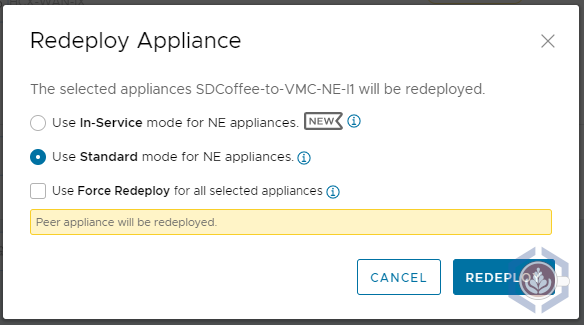
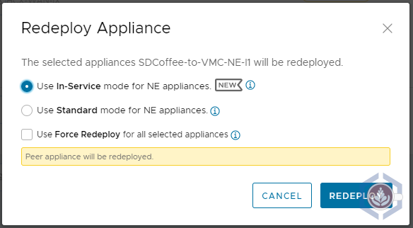

HCX 4.0 introduced plenty of new <u>[features and functionalities](https://blogs.vmware.com/networkvirtualization/2021/02/introducing-hcx4-0.html/)</u>, such as migration details and security tag migrations to name a few. One of the features I like the most is In-Service Upgrade for the network extension appliance(s). While the standard upgrade re-deploys the network extension (NE) appliance, the in-service upgrade will deploy an extra appliance with a new set of IPs prior to removing the old appliance. This will allow HCX to establish a tunnel between the two new appliances and then do a switchover to minimize downtime for the extended networks.

To compare the downtime the extended networks experience using each upgrade method, I tested the impact of each one on the connectivity between two VMs while redeploying the NE appliances. You can read about the steps I performed or jump straight to the test conclusion:
* **<u>[Test Environment Overview](#test-environment-overview)</u>**
* **<u>[Standard Upgrade](#standard-upgrade)</u>**
* **<u>[In-Service Upgrade](#in-service-upgrade)</u>**
* **<u>[Conclusion](#conclusion)</u>**

{}
This test was performed in my lab environment, so the actual results in other environments may vary
{}

### Test Environment Overview


To perform the test I am using my home lab, located in Chicago, and a VMware Cloud on AWS SDDC in Oregon (us-west-2). Both sites are connected via route-based VPN and have HCX deployed and a service mesh configured:


A single network, **site1-vlan11**, is extended between the sites. The CIDR range is **172.25.11.0/24** and my lab's pfSense functions as the default gateway for the network. The pfSense is also the default gateway of the other network I'm using, **core-vlan10** which uses CIDR ****172.25.10.0/24****


The following VMs were used to test the connectivity:
| Name           | Location   | Portgroup                    | IP Address    | OS         |
|----------------|------------|------------------------------|---------------|------------|
| core-mint      | On-prem    | core-vlan10                | 172.25.10.212 | Linux Mint |
| sdcoffee-vlan11 | VMW on AWS | L2E_site1-vlan11-11-189c7e98 | 172.25.11.236 | Photon OS  |



Before running the tests, the NE appliance on-prem is deployed with the following IPs:
| Traffic type       | IP            |
|--------------------|---------------|
| Management Network | 172.25.10.22  |
| Uplink Network     | 192.168.1.222 |



To simulate the process that occurs during an appliance upgrade I opted to redeploy the appliances, as this gives me the option of running the test several times without needing to wait for a new version to upgrade to. To redeploy the appliances, follow these steps:
1. Open the HCX plugin in vCenter or connect to the HCX manager
2. Select **Interconnect** and then the **Service Mesh** tab
3. Under the service mesh you'd like to test, click **View Appliances**
4. Select the NE appliance and click **Redeploy**
5. You'd then have the option of selecting **Standard** or **In-Service** mode
6. Once the redeployment is initiated, the specific steps and actions taken can be viewed in the **Tasks** tab



### Standard Upgrade

Before redeploying the NE appliance I launched the following ping command from **core-mint**, which provides a timestamp and will also show failed ping packets:
```bash
ping -i 1 -O 172.25.11.236 | ts "%H:%M:%.S"
```

Next, I redeployed the NE appliance using **Standard** mode:



During the redeployment process, a new NE appliance will be deployed in both the source and destination sites. In this screenshot, we can see that a new NE appliance is deployed on-prem with the same IPs as the original appliance:



After a couple of minutes, HCX will start configuring the connectivity between the two new NE appliances:



During this step, the tunnel is being established between the two appliances, which means downtime for the extended networks. In my environment the VMs lost connectivity for a little under **25 seconds**:



Once the tunnel is up and running HCX will remove the original appliances and will rename them.

### In-Service Upgrade

Similar to the steps performed in the standard mode test, I started a continuous timestamped ping from **core-mint**. However, when running the same command as I did previously for the first couple of tests I did not see any loss of packets (which is very promising!). Because of that, I changed the ping frequency to 200ms, which is the minimum possible:
```bash
ping -i 0.2 -O 172.25.11.236 | ts "%H:%M:%.S"
```

Next, I redeployed the NE appliance using **In-Service** mode:



Once again, a new NE appliance will be deployed in both the source and destination sites. This time, as seen in the screenshot of the on-prem environment, the new NE appliance is deployed using a different set of IPs:



As a comparison, here are the IPs of the original and newly deployed NE appliance on-prem:
| Interface     | Original NE Appliance | New NE Appliance |
|---------------|-----------------------|------------------|
| Management IP | 172.25.10.22          | 172.25.10.24     |
| Uplink IP     | 192.168.1.222         | 192.168.1.224    |

Since In-Service is using a new set of appliances with different IP addresses the tunnel configuration between them doesn't impact existing traffic. Instead, workloads are only experiencing a short amount of downtime during a new step, the **NetExt Switchover**:



Before this step, there are two sets of appliances with a tunnel established between them. During this step, the network extensions are switched over to the tunnel between the two new appliances. In my environment the VMs lost connectivity for **just a little more than a second**:



Again, once the extensions are switched over to the new appliances HCX will remove the original appliances and rename them.

### Conclusion

Here is the summary of the results I got in the tests of the two upgrade/redeployment modes:

| Metric           | Standard Mode | In-Service Mode                                                                            |
|------------------|---------------|--------------------------------------------------------------------------------------------|
| Network Downtime | 24.55 Seconds | 1.02 Seconds                                                                               |
| Preparation      | None Required | - Additional IP per NE appliance upgraded/redeployed <br> - Service mesh must be in a healthy state <br> - HCX 4.0 and above |

Just as a reminder, this was tested in my lab environment so your mileage may vary. That being said, the difference between the two modes is quite significant. While 25 seconds will definitely impact applications, most shouldn't even notice a 1 second outage, which is similar to what is experienced during vMotion.

Since most of the downtime the HCX extended networks experience is planned due to upgrades, In-Service mode can significantly improve the availability of workloads connected to extended networks.
